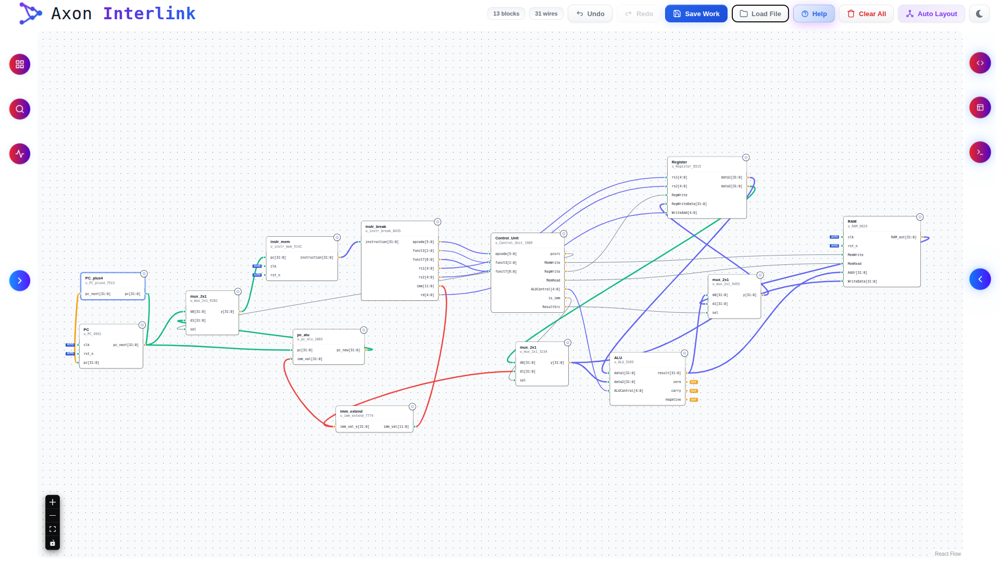

# ⚡ Digital Schematic Editor

A **React‑based digital design tool** for creating, editing, and simulating hardware schematics.  
Drag‑and‑drop blocks, wire them together, run design rule checks (DRC), generate RTL code, and export testbenches – all from your browser.

**Light Mode**


**Dark Mode**


## Live Demo

[Launch the editor](#) –https://ansh-srivastav2023.github.io/axon-interlink/


## Features

- **Visual Schematic Capture** – instantiate modules, draw wires, and rearrange layout.


`The instatntiation can be done in two ways: -`
- Either from the `Standard Cell Library` present in `Left Panel`.
- **Standard Cell Library** – pre‑built gates and functional blocks (AND, OR, MUX, etc.).
- **Custom Module Support** – define your own modules with arbitrary I/O ports.
- **Design Rule Check (DRC)** – instantly detect:
  - Floating inputs
  - Short‑circuited buses
  - Unused outputs
  - Width mismatches
- **Hierarchical Net Tracing** – explore drivers, fanout, and unconnected nets.
- **Live Verilog Code Generation** – structural RTL code for your entire design.
- **Testbench Templates** – auto‑generate basic testbenches to validate your design.
- **Undo / Redo** – full history of changes.
- **Save & Load** – export/import your workspace as a JSON file.
- **Dark / Light Theme** – comfortable for day or night.
- **Collapsible Side Panels** – maximise canvas real estate.
- **Syntax‑highlighted Code View** – Verilog with line numbers and highlighting.
- **Block Diagram Preview** – visual symbol of your top‑level module.


## Tech Stack

- [React](https://reactjs.org/) – UI framework
- [React Flow](https://reactflow.dev/) – node‑based canvas and edge management
- [Tabler Icons](https://tablericons.com/) / [React Icons](https://react-icons.github.io/) – iconography
- CSS‑in‑JS (inline styles) – theming and responsive layout
- Custom Verilog syntax highlighter


## Installation & Setup (to run locally)

```bash
# 1. Clone the repository
git clone https://github.com/Ansh-Srivastav2023/axon-interlink.git
cd axon-interlink

# 2. Install dependencies
npm install

# 3. Start the development server
npm run dev
```

The app will open at `http://localhost:3000`.


## Deployment

Build a production‑ready bundle:

```bash
npm run build
```

Deploy the `build/` folder to any static hosting service:

- **Vercel** – `vercel --prod`
- **Netlify** – drag & drop the build folder
- **GitHub Pages** – use `gh-pages` branch


## Project Structure

```
src
├── App.css
├── App.jsx
├── assets
│   ├── hero.png
│   ├── react.svg
│   └── vite.svg
├── edges
│   ├── Canvas.jsx
│   ├── index.js
│   ├── LeftPanel.jsx
│   ├── ResizeHandle.jsx
│   ├── RightPanel.jsx
│   └── SmartEdge.jsx
├── ErrorBoundary.jsx
├── FlowCanvas.jsx
├── hooks
│   ├── index.js
│   ├── useFileOperations.js
│   └── useHistory.js
├── index.css
├── main.jsx
├── modals
│   ├── ClearModal.jsx
│   ├── ContextualModal.jsx
│   ├── ErrorModal.jsx
│   ├── HelpModal.jsx
│   ├── index.js
│   └── SaveModal.jsx
├── nodes
│   ├── GateNode.jsx
│   ├── HardwareNode.jsx
│   ├── index.js
│   └── SplitterNode.jsx
├── styles
│   ├── getStyles.js
│   ├── icons.jsx
│   ├── index.js
│   ├── InfoIcon.jsx
│   ├── nodeStyles.js
│   └── renderDecorations.jsx
├── utils
│   ├── hardwareutils.js
│   ├── Header.jsx
│   └── Logo.jsx
└── verilog-code
    └── verilogEdits.jsx
```


## How to Use

1. **Add a block** – use the *Library* tab on the left to pick a standard cell or define a custom module.
2. **Draw wires** – click on a port (circle) and drag to another port.
3. **Configure a block** – double‑click or click the `Properties` button in the modal that appears.
4. **Run DRC** – see alerts in the left panel to catch errors.
5. **Generate code** – open the right panel to view structural Verilog or a testbench template.
6. **Search & trace** – use the *Search* tab to find modules, and the *Trace* tab to analyse net connectivity. Bothe buttons are present on the `Left Panel`.
7. **Save your work** – use the *Save Work* button in the header to download a JSON file. Load it later with *Load File*.


## Key Interactions

| Action                  | How to do it |
|-------------------------|--------------|
| Select / move block     | Click and drag on the block |
| Delete block or wire    | Select it and press `Delete` / `Backspace` |
| Undo / Redo             | `Ctrl+Z` / `Ctrl+Y` or header buttons |
| Copy block              | `Ctrl+C` / `Ctrl+V` (selected block) |
| Pan canvas              | Drag the background or use mouse wheel |
| Zoom                    | `Ctrl` + scroll wheel |
| Open modal for block    | Double‑click block, or click the alert in DRC |
| Collapse side panels    | Click the arrow buttons in the panel headers |

-----------------------------------

## Author:- **Ansh Srivastav**

